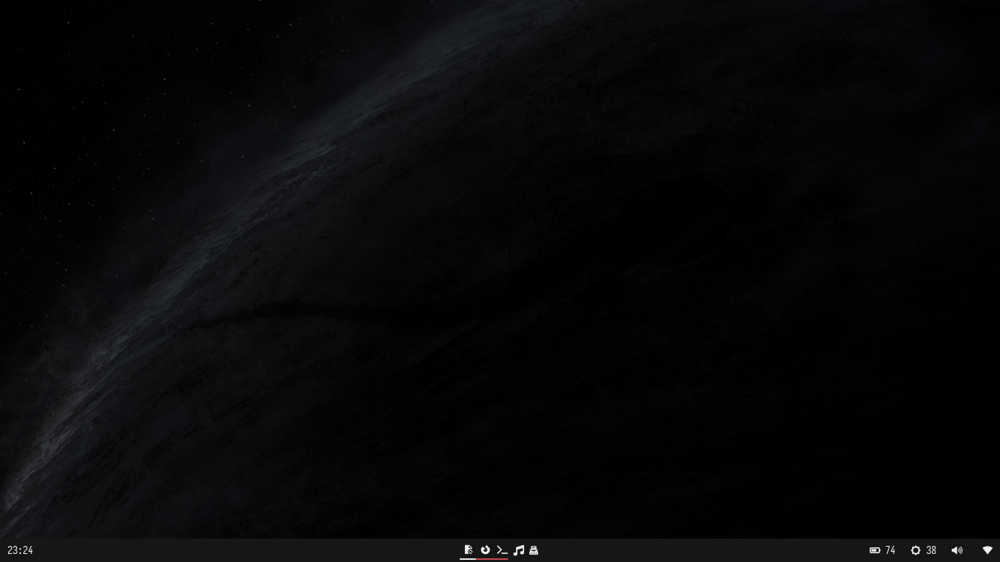

# My Dotfiles 💻

My personal linux dotfiles and configs 🐧

 

- **Distro**: Fedora Linux
- **Shell**: zsh
- **Terminal**: kitty
- **WM**: hyprland
- **Statusbar**: waybar
- **Editor**: neovim
- **Font**: JetBrains Mono, Iosevka NF
- **Terminal Prompt**: starship
- **Pdf Reader**: zathura
- **Multiplexer**: tmux
- **Colorscheme**: oxocarbon
